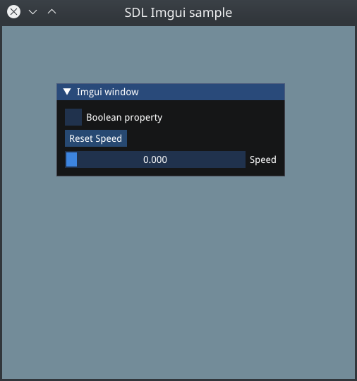

= SDL2 Imgui sample
:source-highlighter: highlightjs
:toc:

== About

An example demonstrating SDL2 alongside Imgui, displaying a window containing interactive elements.  Tuned for Linux.

== Pulling the required Imgui repository after cloning
It requires Imgui as of commit on 30 September 2021 or above, which includes its own OpenGL function loader.

To pull the required Imgui submodule, enter the following commands from this repo's base directory:
[source,shell]
----
git submodule init
git submodule update
----

== Requirments
- SDL2
- OpenGL
- CMake

To install the dependencies on Linux:
[source,shell]
----
apt install libsdl2-dev mesa-common-dev cmake
----

...and your preferred {cpp} compiler (standard 11 or above).

== Building
From this repo's base directory, create a `build` directory for CMake, then change to the `build` directory and make the project:
[source,shell]
----
mkdir build
cd build
cmake ..
make -j4
----

CMake will copy the required Truetype font used in this example.

Run with:
----
./SDL_imgui_sample
----

An SDL2 window will appear containing an Imgui window with interactive elements.

